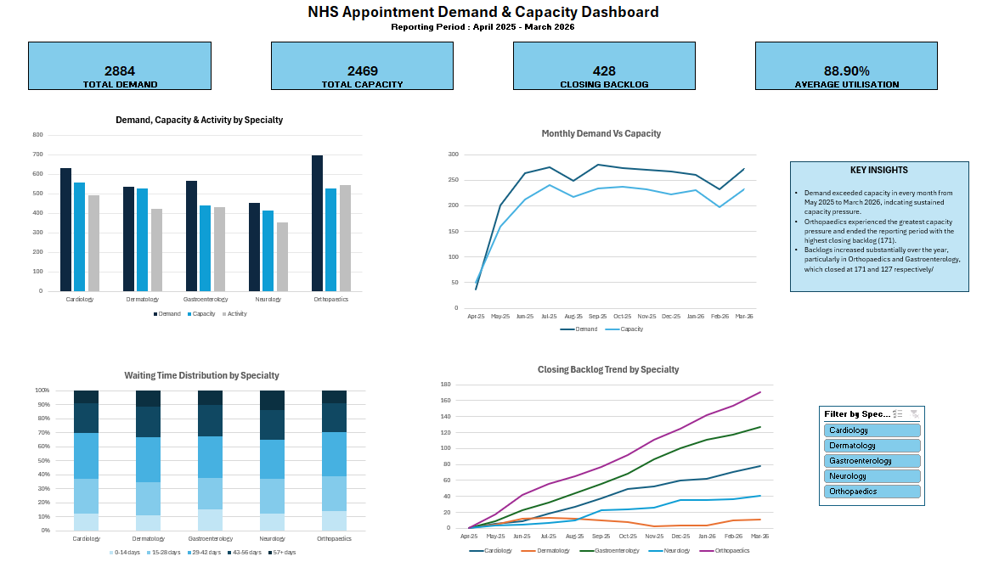
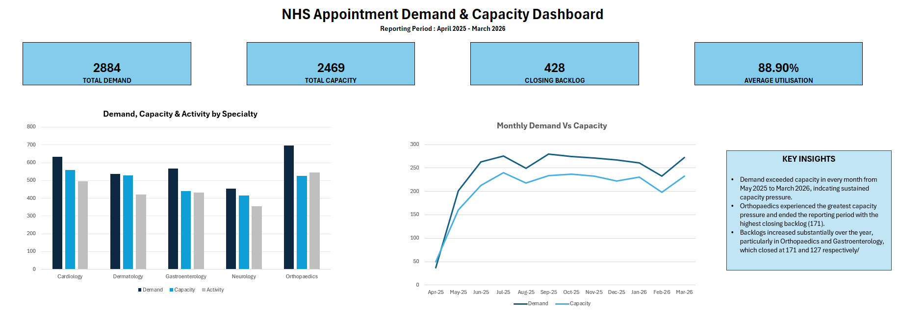
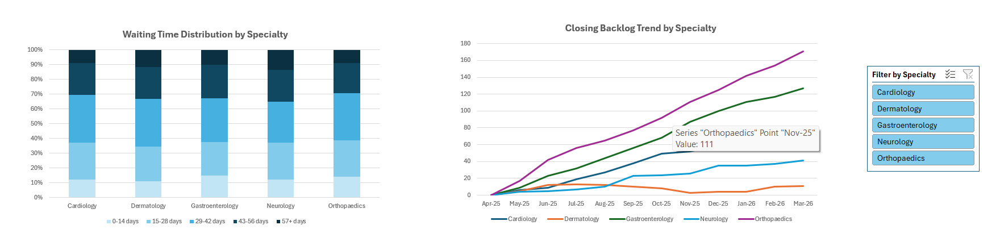

# NHS Appointment Demand & Capacity Analysis
## Project Overview
This Excel data analysis project explores appointment demand, available capacity, activity, waiting times and backlog across five healthcare specialties over the reporting period April 2025 to March 2026.
The aim was to identify areas of operational pressure, assess whether available capacity was sufficient to meet appointment demand, and examine how sustained demand-capacity gaps affected backlog and waiting times.
The project uses synthetic data created for portfolio and learning purposes and contains no real data information.
# Dashboard
## Dashboard Overview

## Dashboard Detail - Demand and Capacity

## Dashboard Detail - Waiting Times and Backlog

## Key Findings
- Total appointment demand was **2,884**, compared with total capacity of **2,469**
- Demand exceeded capacity in every month from **May 2025 to March 2026** , indicating sustained capacity pressure.
- **Orthopaedics** experienced the greatest capacity pressure and ended March 2026 with the highest closing backlog of **171 appointments**
- **Gastroenterology** also showed substantial backlog growth, reaching **127 appointment** by March 2026.
- Overall average utilisation across five specialties was **88.90%**
- The analysis shows how substained gaps between demand and capacity can contribute to increasing service backlogs.

## Analysis Process
### 1. Data Cleaning and Preparation
- Reviewed the appointment dataset for missing values, inconsistencies and duplicate records.
- Standardised specialty names and corrected inconsistent categories.
- Handled missing values in fields such as Priority and Location.
- Prepared appointment dates for monthly analysis from April 2025 to March 2026.
### 2. Demand and Capacity Analysis
- Compared monthly appointment demand against available capacity across five specialties.
- Calculated utilisation rates to identify periods and specialties experiencing capacity pressure.
- Analysed appointment activity, including attended, cancelled and DNA appointments.
### 3. Waiting Time and Backlog Analysis
- Grouped patient waiting times into defined waiting-time bands.
- Analysed waiting-time distributions across specialties.
- Calculated monthly closing backlog to examine how unmet demand accumulated over the reporting period.
### 4. PivotTables and Dashboard
- Built PivotTables to summarise demand, capacity, activity, utilisation, waiting time and backlog.
- Created PivotCharts to visualise key operational trends.
- Developed an interactive Excel Dashboard with KPI cards and a specialty slicer.
- Connected the slicer across relevant PivotTables and dashboard components to allow specialty-level analysis.

## Tools & Skills Demonstrated
- **Microsoft Excel**
- Data Cleaning and Preparation
- Excel formulas including 'COUNTIFS', 'SUMIFS', 'AVERAGES', and 'EDATE'
- PivotTables and PivotCharts
- KPI development
- Demand and capacity analysis
- Utilisation analysis
- Waiting-time analysis
- Backlog analysis
- Interactive dashboard design
- Slicers and PivotTable connections
- Data visualisation and insight communication

## Project Files
**NHS Appointment Demand & Capacity Analysis.xlsx** - Complete Excel workbook containing the dataset, analysis, PivotTables, calculations and interactive dashboard.
**Dashboard-Overview.png** - Full dashboard overview.
**Dashboard-1.png** - Detailed view of demand, capacity and KPI analysis.
**Dashboard-2.png** - Detailed view of waiting-time and backlog analysis.
> ** Note:** This project uses synthetic data created for portfolio and learning purposes. No real patient or confidential NHS data is included.

## Conclusion
The project demonstrates an end-to-end Excel data analysis workflow, from data cleaning and validation through operational analysis and dashboard development.

The analysis identified sustained demand-capacity pressures across the reporting period, with Orthopaedics and Gastroenterology showing particularly notable backlog growth. The final interactive dashboard enables both an overall view of service performance and specialty-level exploration using dynamic KPIs, PivotCharts and slicers.
